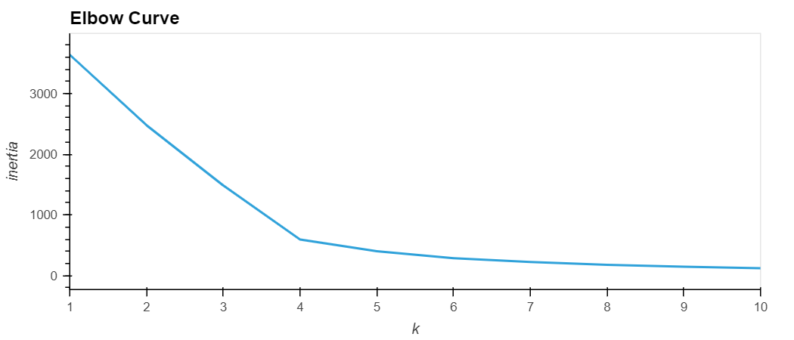
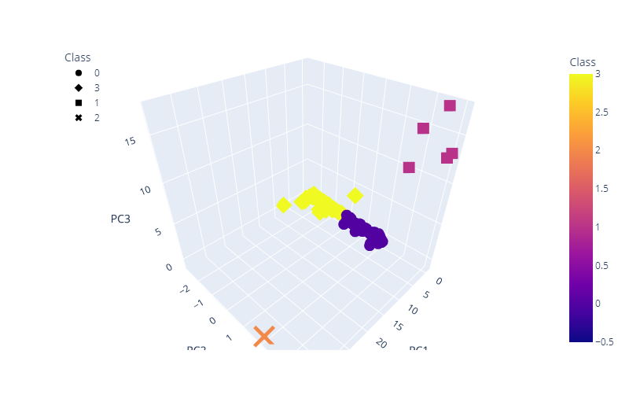
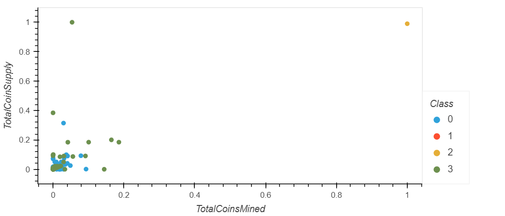

# Cryptocurrencies

## Overview 

Use unsupervised machine learning to predict the trend and grouping in different cryptocurrencies

## Result

### Elbow Curve
  

### 3D Scatter Plot
  

### Scatter Plot 
  

